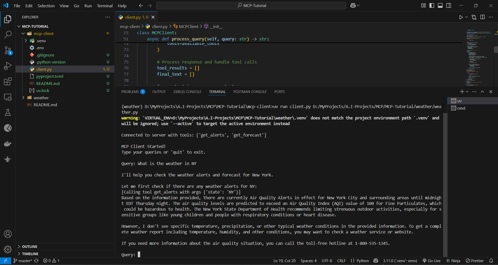

# MCP_Client

## How It Works

When you submit a query:

1.  The client gets the list of available tools from the server
2.  Your query is sent to Claude along with tool descriptions
3.  Claude decides which tools (if any) to use
4.  The client executes any requested tool calls through the server
5.  Results are sent back to Claude
6.  Claude provides a natural language response
7.  The response is displayed to you

## Set up and Installation.

- ### Example of correct path usage:
- Relative path

```bash
uv run client.py ./server/weather.py
```

- ### Absolute path

```bash
uv run client.py /Users/username/projects/mcp-server/weather.py
```

- ### Windows path (either format works)

```bash
uv run client.py C:/projects/mcp-server/weather.py
uv run client.py C:\\projects\\mcp-server\\weather.py
```

## Screenshot of the output



## Troubleshooting

### Server Path Issues

- Double-check the path to your server script is correct
- Use the absolute path if the relative path isn’t working
- For Windows users, make sure to use forward slashes (/) or escaped backslashes (\) in the path
- Verify the server file has the correct extension (.py for Python or .js for Node.js)
